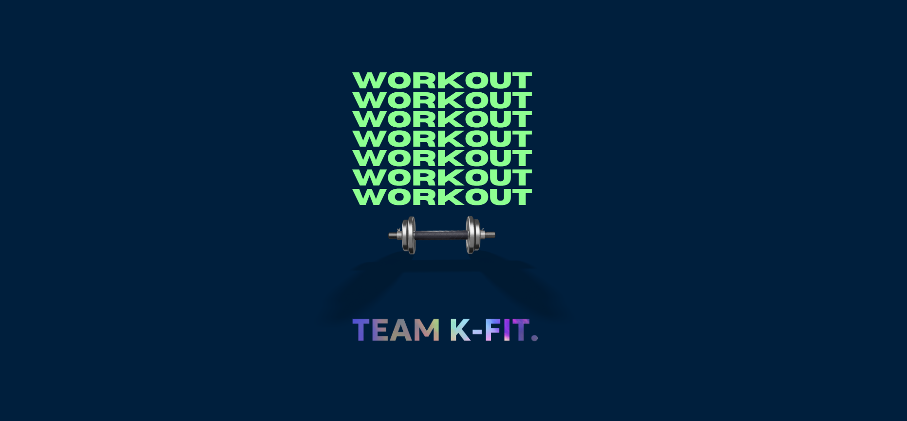
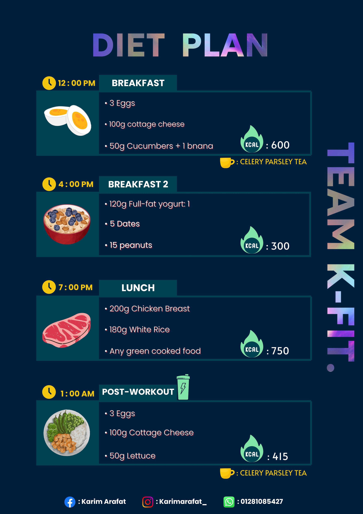
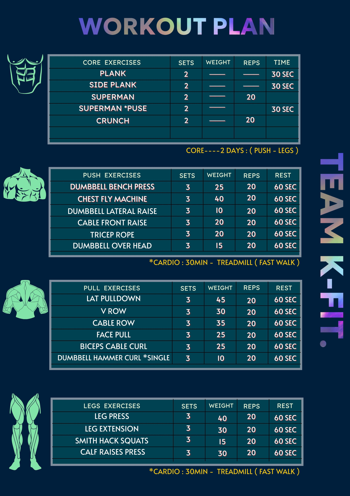
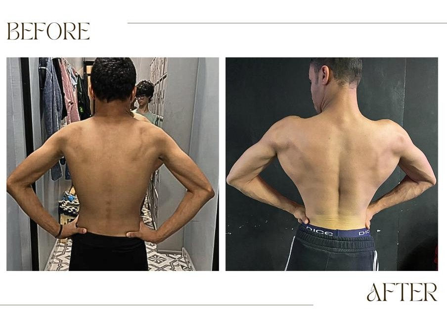

# K-FIT
<!DOCTYPE html>
<html lang="en">
<head>
  <meta name="viewport" content="width=device-width, initial-scale=1.0">
  <meta charset="UTF-8" />
  <meta name="viewport" content="width=device-width, initial-scale=1.0, maximum-scale=1.0, user-scalable=no"/>
  <title>Team K-Fit</title>
  
</head>
<body>

 <!-- Navigation Bar -->
<nav class="navbar">
  

    <!-- Logo on the left -->
    
K-FIT

    
    <!-- Navigation links on the right -->
    <ul>
      <li><a href="#home" class="nav-link active-nav">Home</a></li>
      <li><a href="#message" class="nav-link">Message</a></li>
      <li><a href="#transformations" class="nav-link">Transformations</a></li>
      <li><a href="#plans" class="nav-link">Plans</a></li>
      <li><a href="#contact" class="nav-link">Contact 📞</a></li>
    </ul>
  

</nav>

  <!-- Home Page -->
  

    
  

  <!-- Message Page -->
  

    

      
      
Hi ~ I'm Karim  
      Whether your goal is fat loss, building muscle, or simply improving your overall fitness — you're in the right place.  
      I offer fully customized training and nutrition plans tailored to your lifestyle and goals, with continuous support and expert guidance every step of the way.  
      Let's work together to unlock your full potential. 

      <a href="#plans" class="cta-button">
        STARTING TODAY
      </a>
      <!-- Add your styled new sentence here -->
        
 EXAMPLES !

      
      

        
        
      

    

  

  

  <!-- Transformations Page -->
  

    <h1 class="gradient-title">K-Fit Transformations</h1>
    
Be inspired by the incredible results achieved by our team members.

    
 Real stories. Real people. Real change.

    
    

      

        <!-- Slide 1 -->
        

          
          

            
gained 10kg in 3 months

            
"K-Fit changed my life! I achieved results I never thought possible."

          

        

        <!-- Slide 2 -->
        

          
          

            
Gained 5kg muscle in 4 months

            
"The muscle-building program helped me transform my physique while maintaining feminine curves."

          

        

        <!-- Slide 3 -->
        

          
          

            
Reduced body fat by 8%

            
"From skinny fat to lean and defined - the perfect program for body recomposition."

          

        

        <!-- Slide 4 -->
        

          
          

            
Improved endurance by 40%

            
"I can now run 10km without stopping! The cardio program boosted my stamina dramatically."

          

        

        <!-- Slide 5 -->
        

          
          

            
Lost 12kg, gained muscle

            
"The perfect balance of fat loss and strength training for amazing results."

          

        

        <!-- Slide 6 -->
        

          
          

            
Toned entire body in 8 weeks

            
"Finally achieved the toned look I wanted without getting bulky."

          

        

      

      
      <button class="carousel-btn" id="prevBtn">&#10094;</button>
      <button class="carousel-btn" id="nextBtn">&#10095;</button>
    

    
    

      
      
      
      
      
      
    

  

  <!-- Plans Page -->
  

   <h1 class="keep-original-font gradient-title">Our Plans</h1>
    
Choose the perfect plan for your fitness journey

    
    

      <!-- Training Programs Table -->
      <table class="programs-table">
        <thead>
          <tr>
            <th colspan="2">Training Programs</th>
          </tr>
        </thead>
        <tbody>
          <tr>
            <td class="program-title">Gain Muscle</td>
            <td class="program-description">
              • Progressive overload training 
              • High-protein nutrition plan 
              • Recovery strategies 
              • Supplement guidance
              
            </td>
          </tr>
          <tr>
            <td class="program-title">Lose Fat</td>
            <td class="program-description">
              • Fat-burning workouts 
              • Calorie-deficit meal plans 
              • Cardio strategies 
              • Metabolism boosting
              
            </td>
          </tr>
          <tr>
            <td class="program-title">Fitness Lifestyle</td>
            <td class="program-description">
              • Balanced workout routine 
              • Sustainable nutrition 
              • Stress management 
              • Long-term wellness
              
            </td>
          </tr>
        </tbody>
      </table>

      <!-- Pricing Table -->
      <table class="pricing-table">
        <thead>
          <tr>
            <th colspan="3">Pricing Plans</th>
          </tr>
          <tr>
            <th>Duration</th>
            <th>Price</th>
            <th>Action</th>
          </tr>
        </thead>
        <tbody>
          <tr>
            <td>1 Month</td>
            <td class="price-amount">$24 (1200 EGP)</td>
            <td><a href="https://ipn.eg/S/karim.arafat8640/instapay/0fheId-for-1month" class="plan-button" target="_blank">Choose</a></td>
          </tr>
          <tr>
            <td>3 Months</td>
            <td class="price-amount">$60 (3000 EGP) Save $12 (600 EGP)
           
            </td>
            <td><a href="https://ipn.eg/S/karim.arafat8640/instapay/0fheId-for-3months" class="plan-button" target="_blank">Choose</a></td>
          </tr>
          <tr>
            <td>6 Months</td>
            <td class="price-amount">$108 (5400 EGP) Save $36 (1800 EGP)
              
            </td>
            <td><a href="https://ipn.eg/S/karim.arafat8640/instapay/0fheId-for-6months" class="plan-button" target="_blank">Choose</a></td>
          </tr>
          <tr>
            <td>1 Year</td>
            <td class="price-amount">$192 (9600 EGP) Save $96 (4800 EGP)
              
            </td>
            <td><a href="https://ipn.eg/S/karim.arafat8640/instapay/0fheId-for-1year" class="plan-button" target="_blank">Choose</a></td>
          </tr>
        </tbody>
      </table>
    

  

 <!-- Contact Page -->

  <h1 class="gradient-title">Contact Us</h1>
  
Get in touch with Team K-Fit for any questions or to start your fitness journey today!

  
  

    <!-- Instagram -->
    

      <a href="https://www.instagram.com/karimarafat_?igsh=OWI3dGZpbTE4NDhh" target="_blank" class="social-link">
        
        Instagram
      </a>
    

    
    <!-- Facebook -->
    

      <a href="https://www.facebook.com/share/16mR7niBYz/?mibextid=wwXIfr" target="_blank" class="social-link">
        
        Facebook
      </a>
    

    
    <!-- WhatsApp -->
    

      <a href="http://wa.me/201281085427" target="_blank" class="social-link">
        
        WhatsApp
      </a>
    

  

  
</body>
</html>
